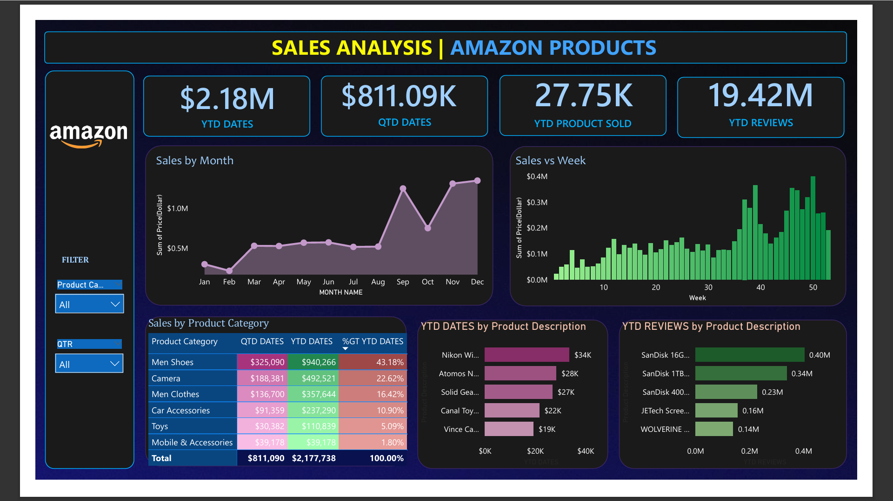

# 📊 Amazon Sales Analysis – Power BI Dashboard

This Power BI project provides a comprehensive analysis of Amazon sales data. It offers actionable insights into sales performance, customer behavior, and product trends to support data-driven decision-making.

## 🚀 Features

- Interactive Power BI dashboard
- Visualizations for:
  - Sales performance over time
  - Product category analysis
  - Customer segmentation
  - Order trends and delivery performance
- Filters and slicers for dynamic exploration

## 🖼️ Dashboard Preview

## 📁 Project Structure

 amazon-sales-analysis/
┣ 📄 amazon sales analysis Power Bi.pbix
┣ 📄 amazon_sales_data.csv
┣ 📄 dashboard-preview.png
┗ 📄 README.md

## 📈 Features

- Time-series analysis of sales trends
- Product category performance
- Geographic sales breakdown
- Customer segmentation
- Delivery and return performance
- Dynamic filters and slicers

## 📊 Dataset

The dataset used in this project is included as a CSV file:

- **File**: `amazon_sales_data.csv`
- **Columns** (example): `Order ID`, `Order Date`, `Ship Date`, `Product Category`, `Sub-Category`, `Sales`, `Quantity`, `Discount`, `Profit`, `Customer Segment`, `Region`, `Return Status`

🧰 Built With
Power BI Desktop

Power Query – data transformation

DAX (Data Analysis Expressions) – for KPIs and calculated columns

CSV – raw data format

💡 Insights Provided
Sales performance by month and region

Top-performing categories and sub-categories

Customer behavior trends

Order fulfillment and return metrics

## 📌 Author

Arijit Pal
[www.linkedin.com/in/arijit-pal-1a4b55211]  
[https://github.com/ArijitPal0409]

